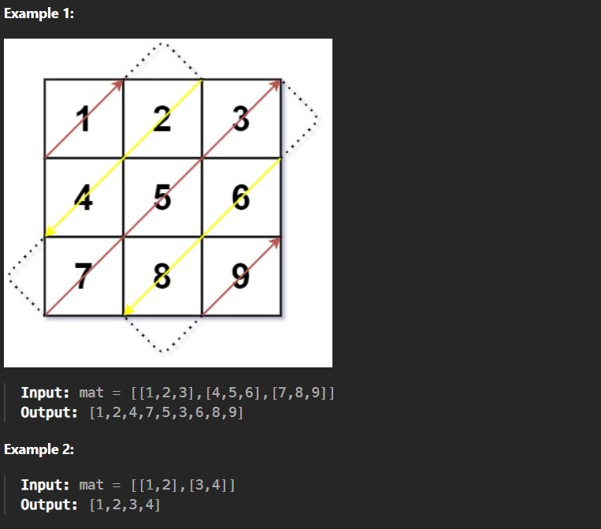

Given an m x n matrix mat, return an array of all the elements of the array in a diagonal order.

Constraints:

m == mat.length

n == mat[i].length

1 <= m, n <= 10^4

1 <= m * n <= 10^4

-10^5 <= mat[i][j] <= 10^5
