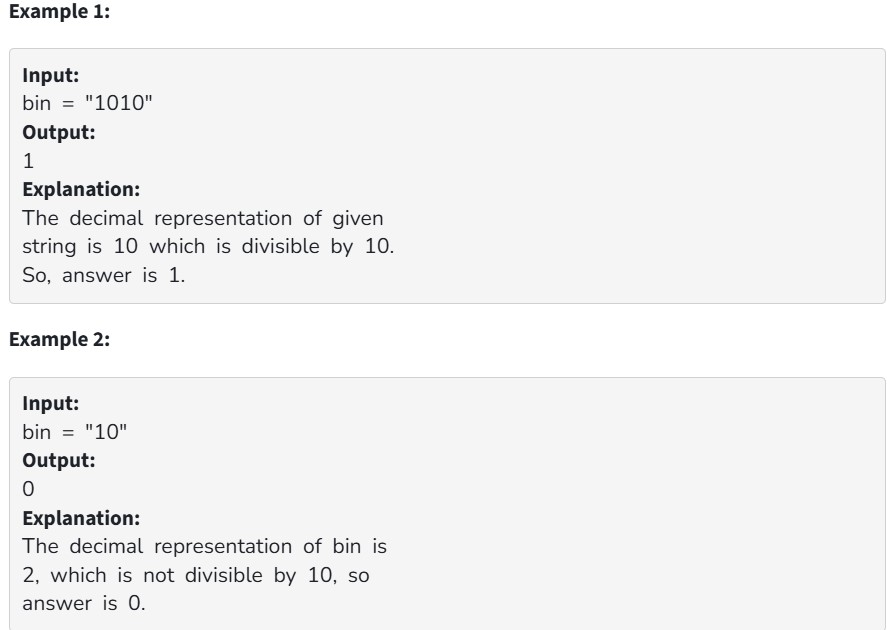

Given a binary number in the form of string, the task is to check whether the decimal representation of the given binary number is divisible by 10 or not. The number could be very large and may not fit even in long long int.

Your Task:
You don't need to read input or print anything.Your Task is to complete the function isDivisibleBy10() which takes a binary string bin as input parameter and returns 0 if the decimal representaion of bin is not divisible by 10.Otherwise it returns 1.

Expected Time Complexity:O(N)

Expected Auxillary Space:O(1)

Constraints:

1 <= |bin| <= 10^5
