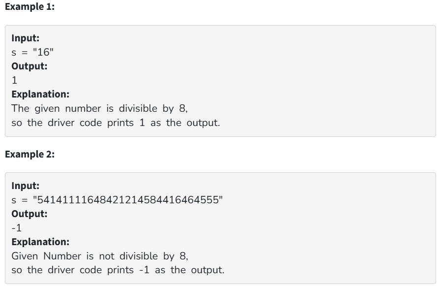

Given a string representation of a decimal number s, check whether it is divisible by 8.

Your Task:
You don't need to read input or print anything.Your task is to complete the function DivisibleByEight() which takes a string s as the input and returns 1 if the number is divisible by 8, else it returns -1.

Expected Time Complexity: O(1).

Expected Auxillary Space: O(1).

Constraints:

1 <= |s| <= 10^6
