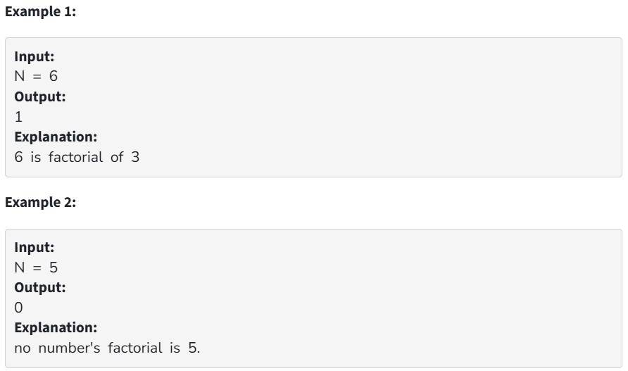

For a given number N, find whether it is a factorial number or not. A Factorial number is a number which is equal to the factorial value of other numbers.

Your Task:

You don't need to read input or print anything. Your task is to complete the function isFactorial() which takes an integer N as input parameters and returns 1 if N is a factorial number, or 0 otherwise.
 

Expected Time Complexity: O(log N)

Expected Space Complexity: O(1)
 

Constraints:

1 <= N <= 100000
