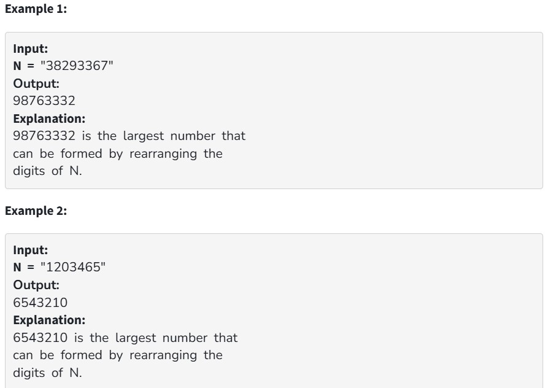

Given a number N, write a program to find a maximum number that can be formed using all of the digits of this number.
Note: The given number can be very large, so the input is taken as a String.

Your Task:

You don't need to read input or print anything. Your task is to complete the function findMax() which takes a String N as input and returns the answer.

 

Expected Time Complexity: O(|N|)

Expected Auxiliary Space: O(constant)

 

Constraints:

1 <= |N| <= 10^5
