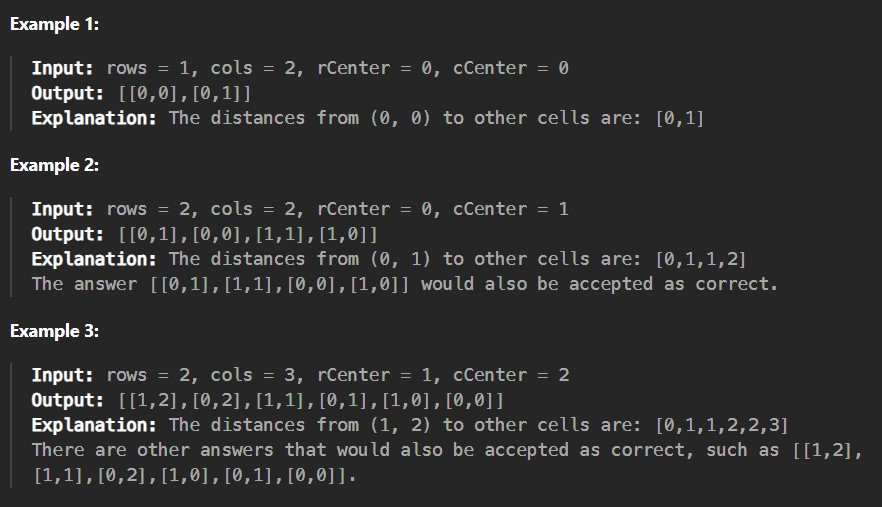

You are given four integers row, cols, rCenter, and cCenter. There is a rows x cols matrix and you are on the cell with the coordinates (rCenter, cCenter).

Return the coordinates of all cells in the matrix, sorted by their distance from (rCenter, cCenter) from the smallest distance to the largest distance. You may return the answer in any order that satisfies this condition.

The distance between two cells (r1, c1) and (r2, c2) is |r1 - r2| + |c1 - c2|.

 

Constraints:

1 <= rows, cols <= 100

0 <= rCenter < rows

0 <= cCenter < cols
