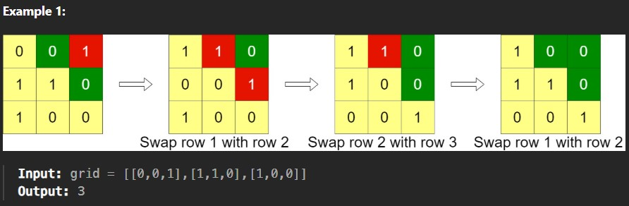
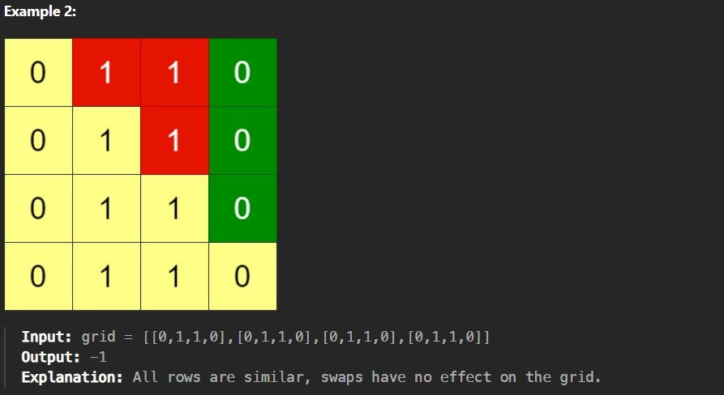

Given an n x n binary grid, in one step you can choose two adjacent rows of the grid and swap them.

A grid is said to be valid if all the cells above the main diagonal are zeros.

Return the minimum number of steps needed to make the grid valid, or -1 if the grid cannot be valid.

The main diagonal of a grid is the diagonal that starts at cell (1, 1) and ends at cell (n, n).

Constraints:

n == grid.length == grid[i].length

1 <= n <= 200

grid[i][j] is either 0 or 1
