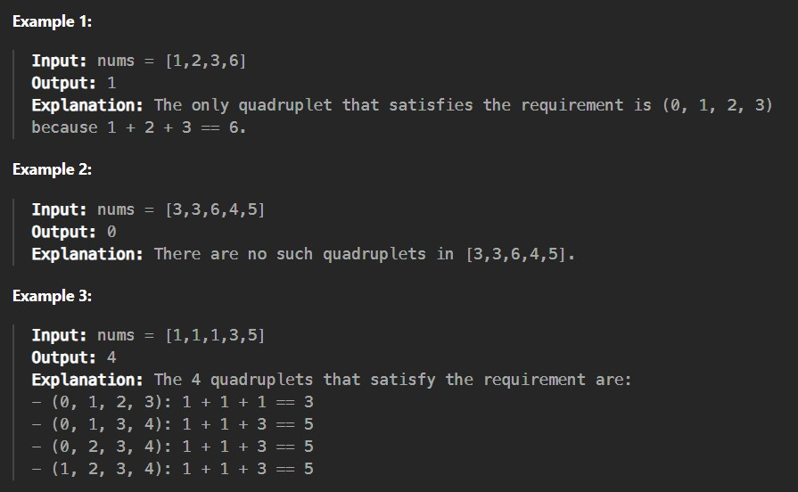

Given a 0-indexed integer array nums, return the number of distinct quadruplets (a, b, c, d) such that:

nums[a] + nums[b] + nums[c] == nums[d], anda < b < c < d
 

Constraints:

0 <= nums.length <= 50

1 <= nums[i] <= 100
