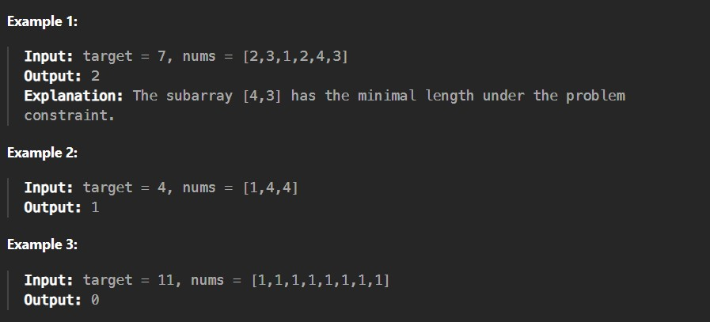

Given an array of positive integers nums and a positive integer target, return the minimal length of a subarray whose sum is greater than or equal to target. If there is no such subarray, return 0 instead.

Constraints:

1 <= target <= 10^9

1 <= nums.length <= 10^5

1 <= nums[i] <= 10^4
 
