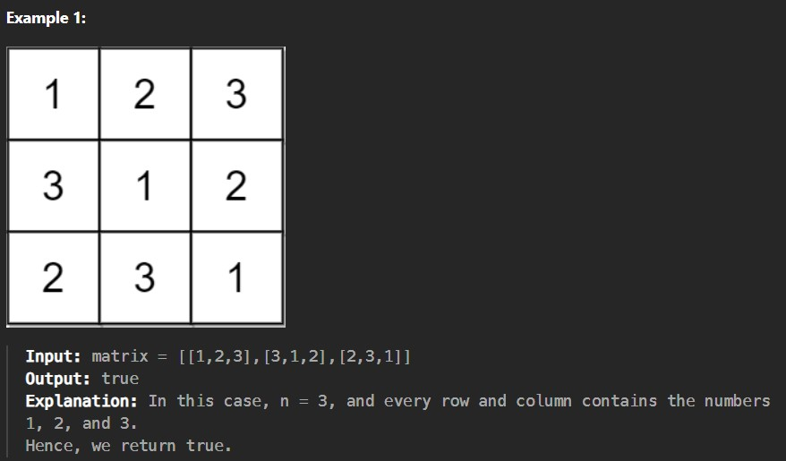
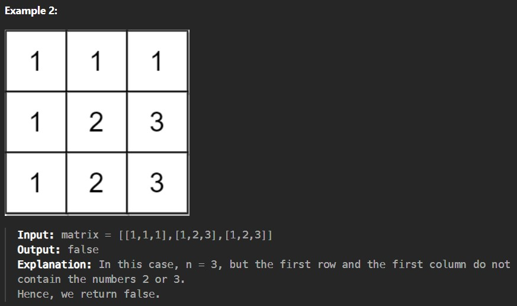

An n x n matrix is valid if every row and every column contains all the integers from 1 to n (inclusive).

Given an n x n integer matrix matrix, return true if the matrix is valid. Otherwise, return false.

Constraints:

n == matrix.length == matrix[i].length

1 <= n <= 100

1 <= matrix[i][j] <= n
