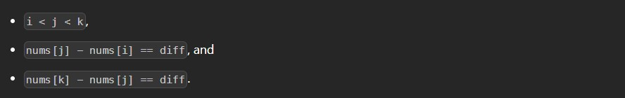
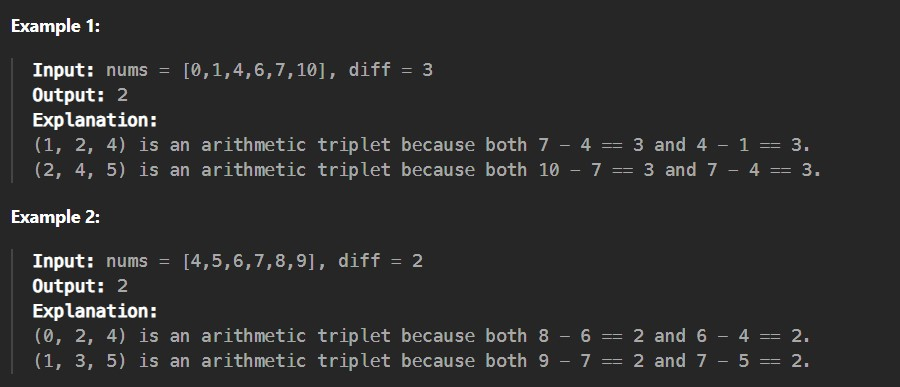

You are given a 0-indexed, strictly increasing integer array nums and a positive integer diff. A triplet (i, j, k) is an arithmetic triplet if the following conditions are met:

Return the number of unique arithmetic triplets.

 
Constraints:

3 <= nums.length <= 200

0 <= nums[i] <= 200

1 <= diff <= 50

nums is strictly increasing.
