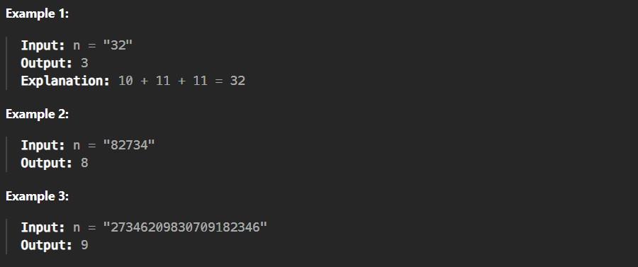
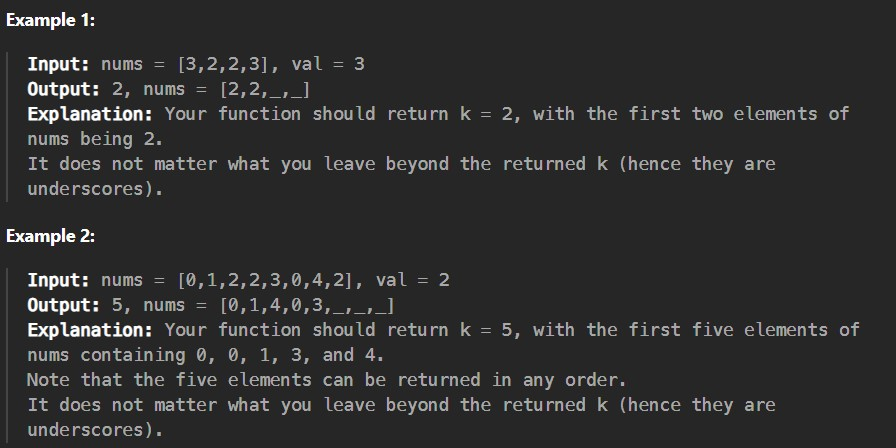

Given an integer array nums and an integer val, remove all occurrences of val in nums in-place. The order of the elements may be changed. Then return the number of elements in nums which are not equal to val.

Consider the number of elements in nums which are not equal to val be k, to get accepted, you need to do the following things:

Change the array nums such that the first k elements of nums contain the elements which are not equal to val. The remaining elements of nums are not important as well as the size of nums.

Return k.

Custom Judge:

The judge will test your solution with the following code:

If all assertions pass, then your solution will be accepted.

Constraints:

0 <= nums.length <= 100

0 <= nums[i] <= 50

0 <= val <= 100
