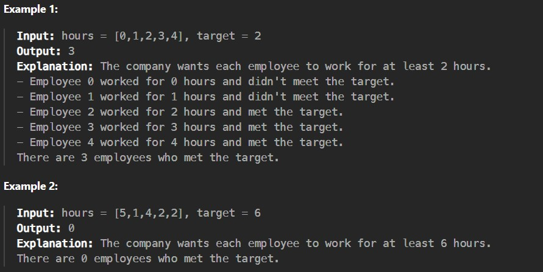

There are n employees in a company, numbered from 0 to n - 1. Each employee i has worked for hours[i] hours in the company.

The company requires each employee to work for at least target hours.

You are given a 0-indexed array of non-negative integers hours of length n and a non-negative integer target.

Return the integer denoting the number of employees who worked at least target hours.

Constraints:

1 <= n == hours.length <= 50

0 <= hours[i], target <= 10^5
