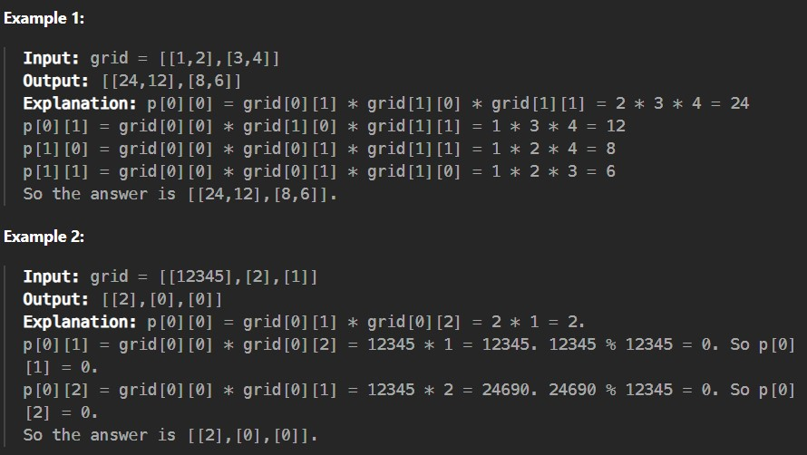

Given a 0-indexed 2D integer matrix grid of size n * m, we define a 0-indexed 2D matrix p of size n * m as the product matrix of grid if the following condition is met:

Each element p[i][j] is calculated as the product of all elements in grid except for the element grid[i][j]. This product is then taken modulo 12345.
Return the product matrix of grid.

Constraints:

1 <= n == grid.length <= 10^5

1 <= m == grid[i].length <= 10^5

2 <= n * m <= 10^5

1 <= grid[i][j] <= 10^9
