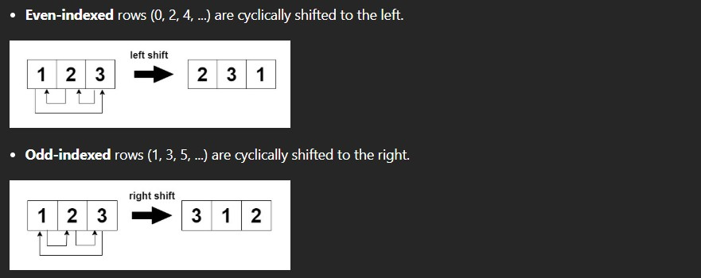
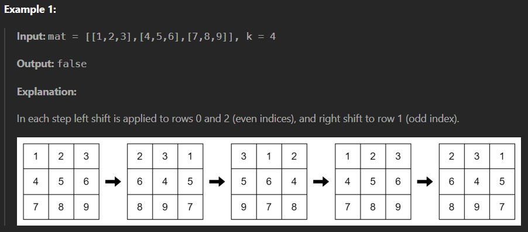
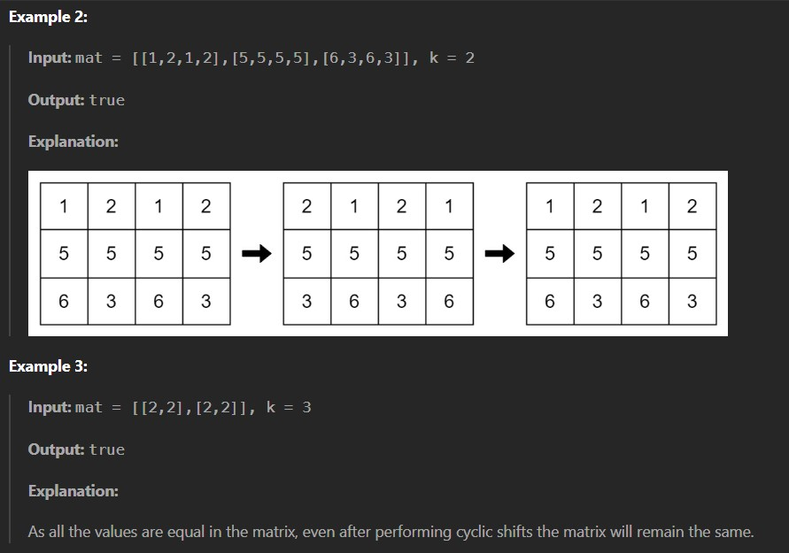

You are given an m x n integer matrix mat and an integer k. The matrix rows are 0-indexed.

The following proccess happens k times:

Return true if the final modified matrix after k steps is identical to the original matrix, and false otherwise.

Constraints:

1 <= mat.length <= 25

1 <= mat[i].length <= 25

1 <= mat[i][j] <= 25

1 <= k <= 50
