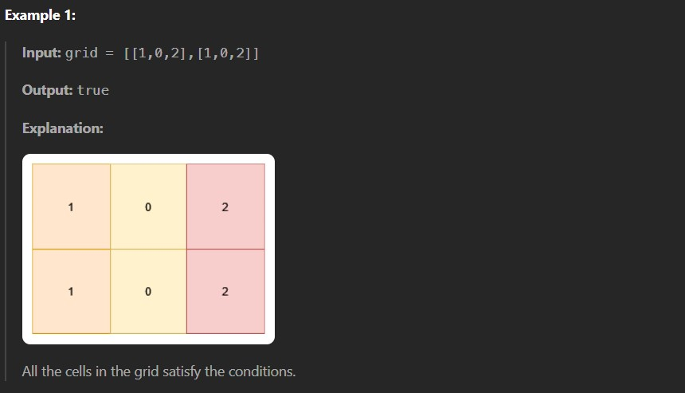
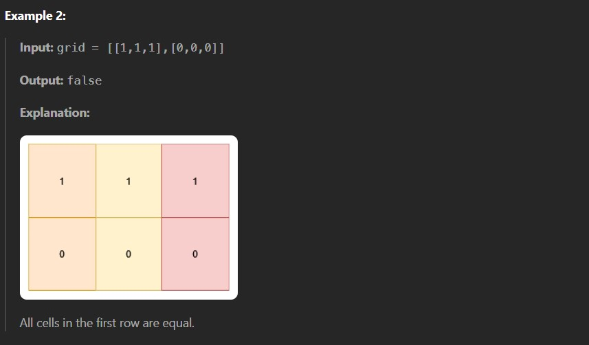
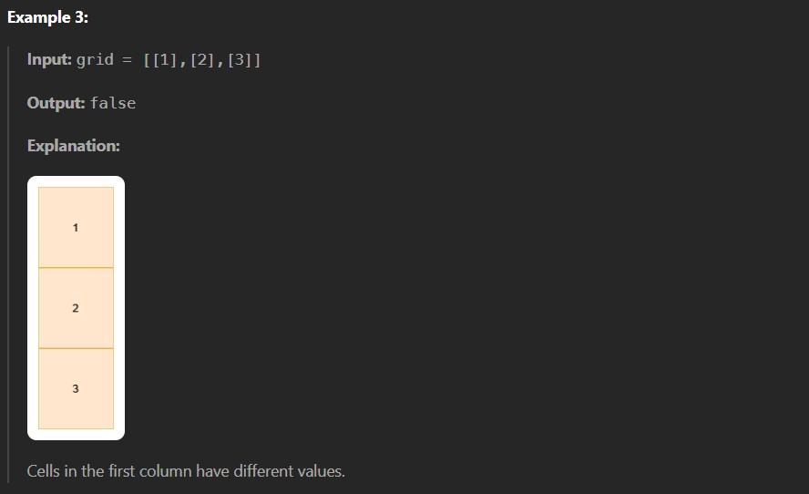

You are given a 2D matrix grid of size m x n. You need to check if each cell grid[i][j] is:

Equal to the cell below it, i.e. grid[i][j] == grid[i + 1][j] (if it exists).

Different from the cell to its right, i.e. grid[i][j] != grid[i][j + 1] (if it exists).

Return true if all the cells satisfy these conditions, otherwise, return false.

Constraints:

1 <= n, m <= 10

0 <= grid[i][j] <= 9 
