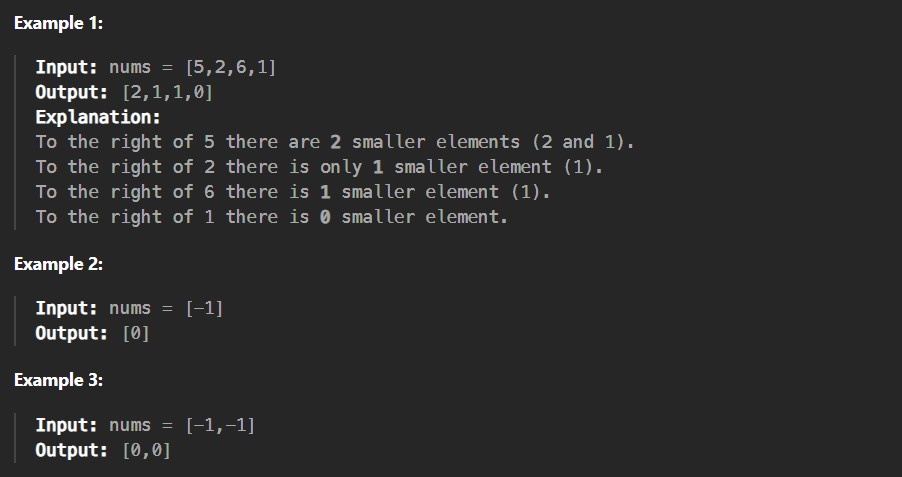

Given an integer array nums, return an integer array counts where counts[i] is the number of smaller elements to the right of nums[i].

Constraints:

1 <= nums.length <= 10^5

-10^4 <= nums[i] <= 10^4
