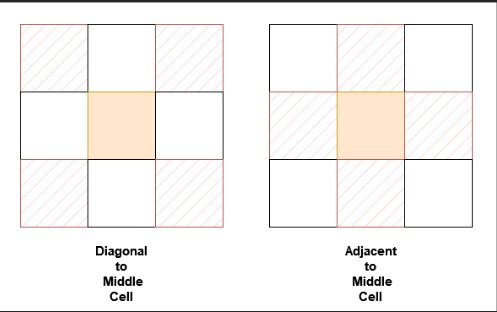
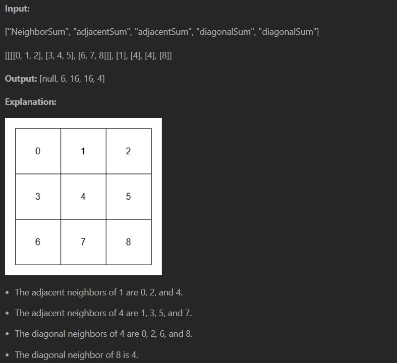
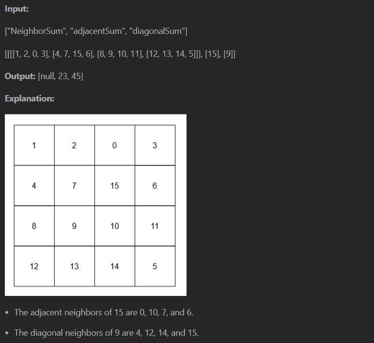

You are given a n x n 2D array grid containing distinct elements in the range [0, n2 - 1].

Implement the NeighborSum class:

NeighborSum(int [][]grid) initializes the object.

int adjacentSum(int value) returns the sum of elements which are adjacent neighbors of value, that is either to the top, left, right, or bottom of value in grid.

int diagonalSum(int value) returns the sum of elements which are diagonal neighbors of value, that is either to the top-left, top-right, bottom-left, or bottom-right of value in grid.

Example 1:

Example 1:

Constraints:

3 <= n == grid.length == grid[0].length <= 10

0 <= grid[i][j] <= n^2 - 1

All grid[i][j] are distinct.

Value in adjacentSum and diagonalSum will be in the range [0, n^2 - 1].

At most 2 * n^2 calls will be made to adjacentSum and diagonalSum.
