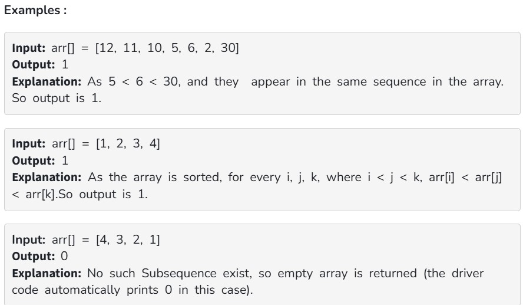

Given an array arr[], find any subsequence of three elements such that, arr[i] < arr[j] < arr[k] and (i < j < k).

If such a subsequence exists, return the three elements as an array. Otherwise, return an empty array.

Note:

The driver code will print 1 if the returned subsequence is valid and present in the array.

The driver code will print 0 if no such subsequence exists.

If the returned subsequence does not satisfy the required format or conditions, the output will be -1.

Constraints:

1 ≤ arr.size() ≤ 10^5

1 ≤ arr[i] ≤ 10^6
