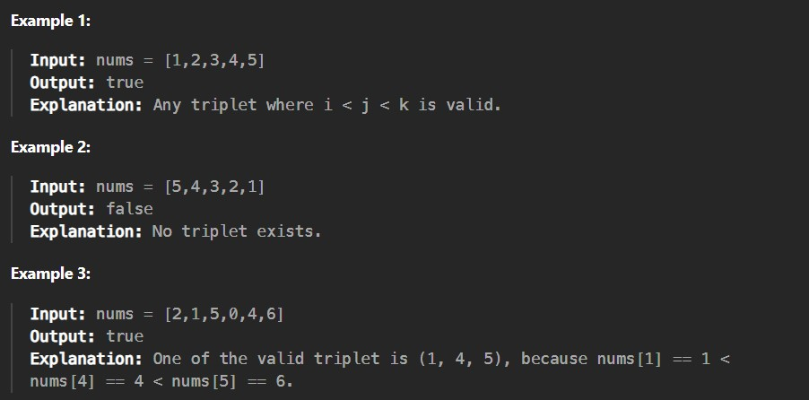

Given an integer array nums, return true if there exists a triple of indices (i, j, k) such that i < j < k and nums[i] < nums[j] < nums[k]. If no such indices exists, return false.

 

Constraints:

1 <= nums.length <= 5 * 10^5

-2^31 <= nums[i] <= 2^31 - 1
