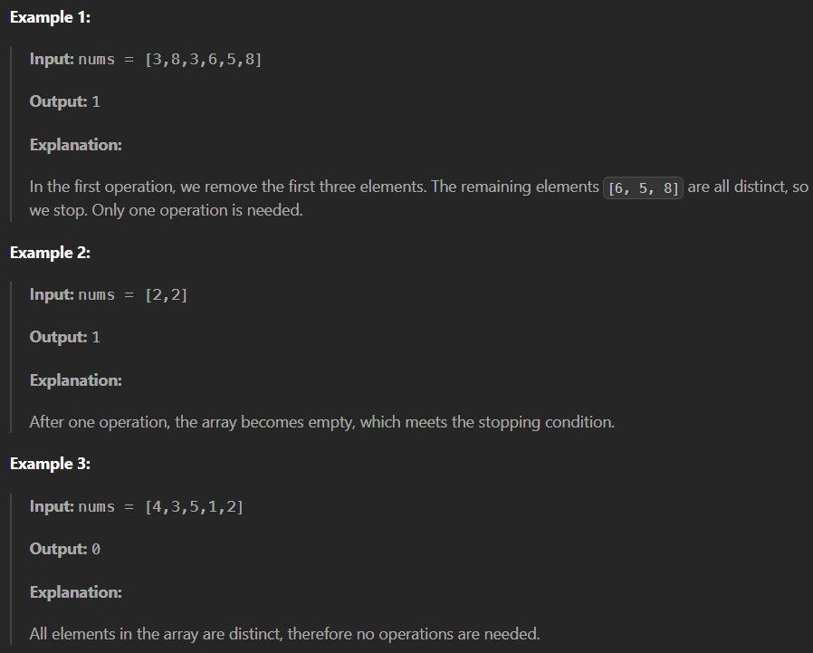

You are given an integer array nums.

In one operation, you remove the first three elements of the current array. If there are fewer than three elements remaining, all remaining elements are removed.

Repeat this operation until the array is empty or contains no duplicate values.

Return an integer denoting the number of operations required.

 
Constraints:

1 <= nums.length <= 10^5

1 <= nums[i] <= 10^5
