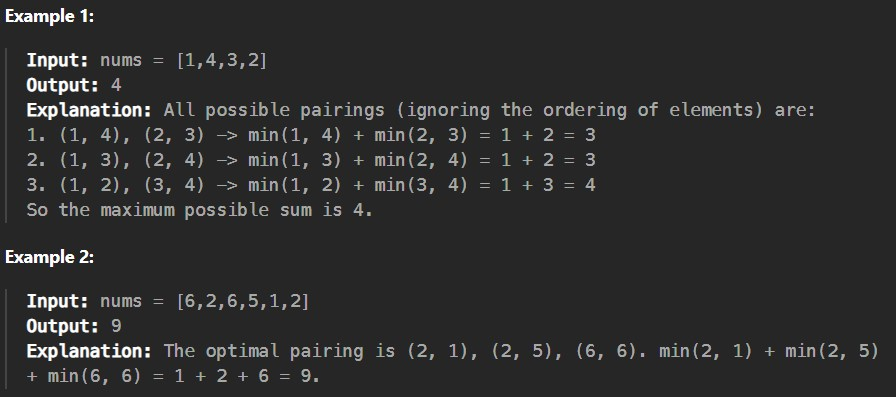

Given an integer array nums of 2n integers, group these integers into n pairs (a1, b1), (a2, b2), ..., (an, bn) such that the sum of min(ai, bi) for all i is maximized. Return the maximized sum.

Constraints:

1 <= n <= 10^4

nums.length == 2 * n

-10^4 <= nums[i] <= 10^4
