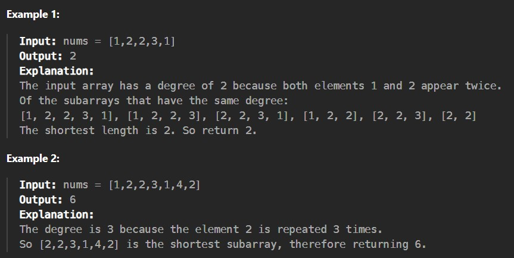

Given a non-empty array of non-negative integers nums, the degree of this array is defined as the maximum frequency of any one of its elements.

Your task is to find the smallest possible length of a (contiguous) subarray of nums, that has the same degree as nums.

Constraints:

nums.length will be between 1 and 50,000.

nums[i] will be an integer between 0 and 49,999.
