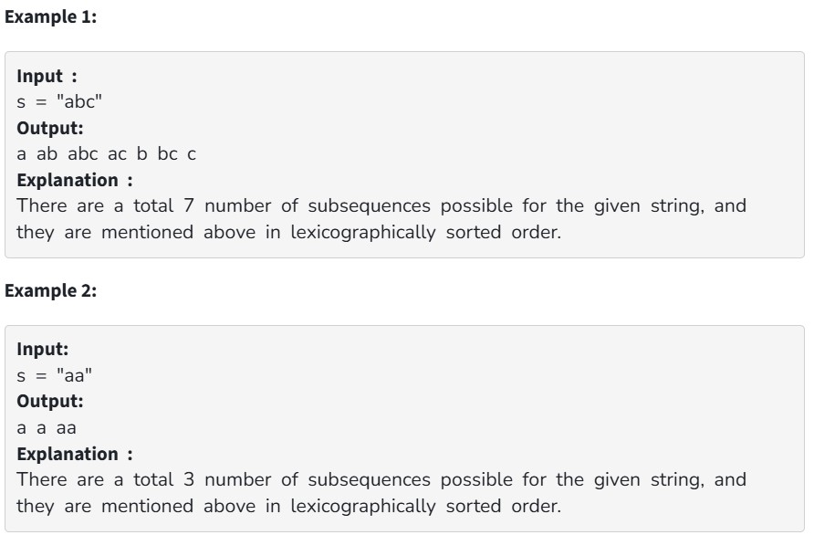

Given a string s of length n, find all the possible non-empty subsequences of the string s in lexicographically-sorted order.

Your Task:

You don't need to read input or print anything. Your task is to complete the function AllPossibleStrings() which takes a string s as the input parameter and returns a list of all possible subsequences (non-empty) that can be formed from s in lexicographically sorted order.

Expected Time Complexity: O( n*2^n  )

Expected Space Complexity: O( n * 2^n )

Constraints: 

1 <= n <= 16

s constitutes of lower case english alphabets
