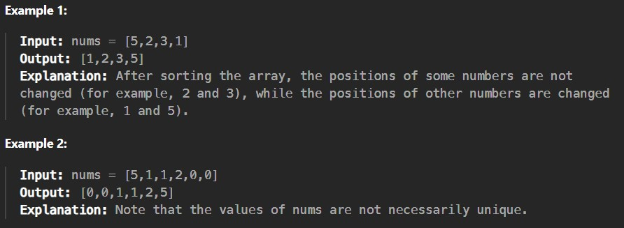

Given an array of integers nums, sort the array in ascending order and return it.

You must solve the problem without using any built-in functions in O(nlog(n)) time complexity and with the smallest space complexity possible.

Constraints:

1 <= nums.length <= 5 * 10^4

-5 * 10^4 <= nums[i] <= 5 * 10^4
