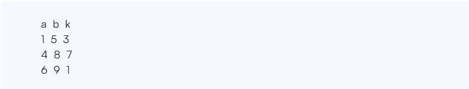
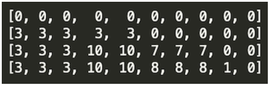

Starting with a 1-indexed array of zeros and a list of operations, for each operation add a value to each array element between two given indices, inclusive. Once all operations have been performed, return the maximum value in the array.

Example:

n = 10

queries = [[1,5,3],[4,8,7],[6,9,1]]

Queries are interpreted as follows:

Add the values of k between the indices a and b inclusive:

The largest value is 10 after all operations are performed.

Function Description

Complete the function array Manipulation with the following parameters:

int n: the number of elements in the array

int queries[q][3]: a two dimensional array of queries where each queries[i] contain three integers a,b and k

Returns

int n: the maximum value in the resultant array

Input format:

The first line contains two space-separated integers n and q, the size of the array and the number of queries. Each of the next q  lines contains three space-separated integers a,b  and k, the left index, right index and number to add.     

