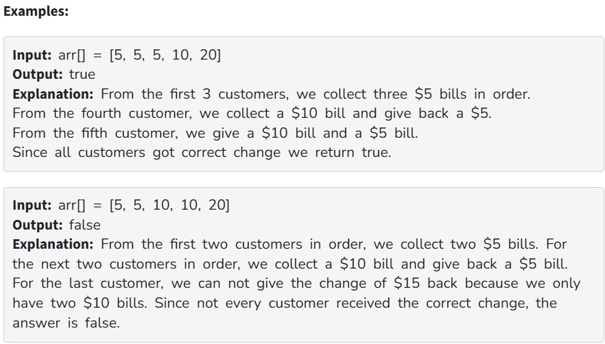

You are given an array arr[] representing passengers in a queue. Each bus ticket costs 5 coins, and arr[i] denotes the note a passenger uses to pay (which can be 5, 10, or 20). You must serve the passengers in the given order and always provide the correct change so that each passenger effectively pays exactly 5 coins. Your task is to determine whether it is possible to serve all passengers in the queue without ever running out of change.

Constraints:

1 ≤ arr.size() ≤ 10^5

arr[i] contains only [5, 10, 20]
