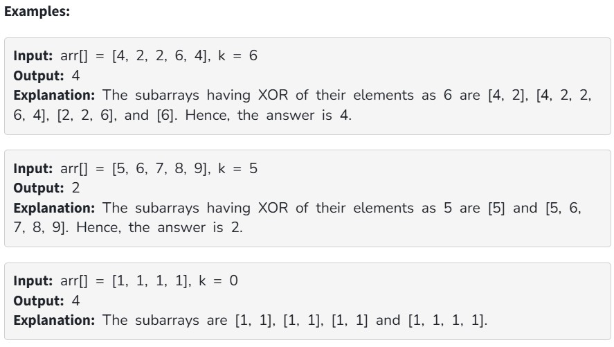

Given an array of integers arr[] and a number k, count the number of subarrays having XOR of their elements as k.

Note: It is guranteed that the total count will fit within a 32-bit integer.

Constraints:

1 ≤ arr.size() ≤ 10^5

0 ≤ arr[i] ≤ 10^5

0 ≤ k ≤ 10^5
