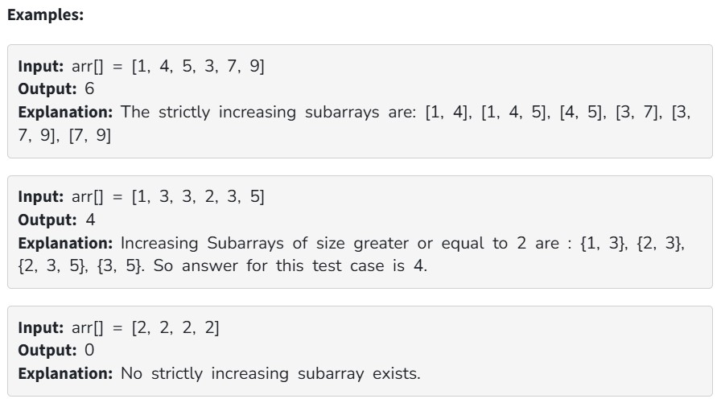

Given an array arr[] of integers, count the number of subarrays in arr[] which are strictly increasing with size greater or equal to 2. A subarray is a contiguous part of array. A subarray is strictly increasing if each element is greater then it's previous element if it exists.

Constraints:

1 ≤ arr.size() ≤ 10^5

1 ≤ arr[i] ≤ 10^7
