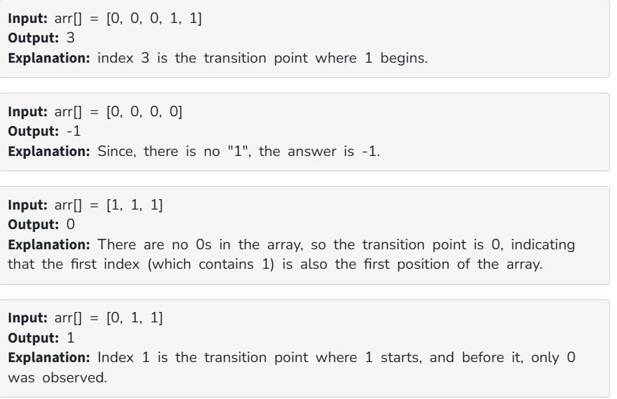

Given a sorted array, arr[] containing only 0s and 1s, find the transition point, i.e., the first index where 1 was observed, and before that, only 0 was observed.  If arr does not have any 1, return -1. If array does not have any 0, return 0.

Constraints:

1 ≤ arr.size() ≤ 10^5

0 ≤ arr[i] ≤ 1
