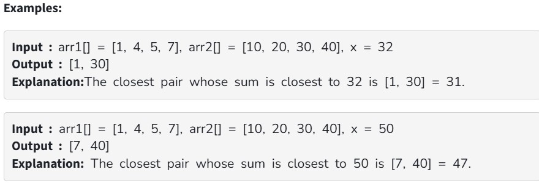

Given two sorted arrays arr1[] and arr2[] of size n and m and a number x, find the pair whose sum is closest to x and the pair has an element from each array. In the case of multiple closest pairs return any one of them.

Note : In the driver code, the absolute difference between the sum of the closest pair and x is printed.

Constraints:

1 ≤ arr1.size(), arr2.size() ≤ 10^5

1 ≤ arr1[i], arr2[i] ≤ 10^9

1 ≤ x ≤ 10^9
