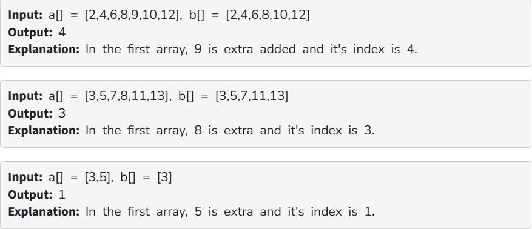

You have given two sorted arrays arr1[] & arr2[] of distinct elements. The first array has one element extra added in between. Return the index of the extra element.

Note: 0-based indexing is followed

Constraints:

2<=arr1.size()<=10^5

1<=arr1[i],arr2[i]<=10^6
