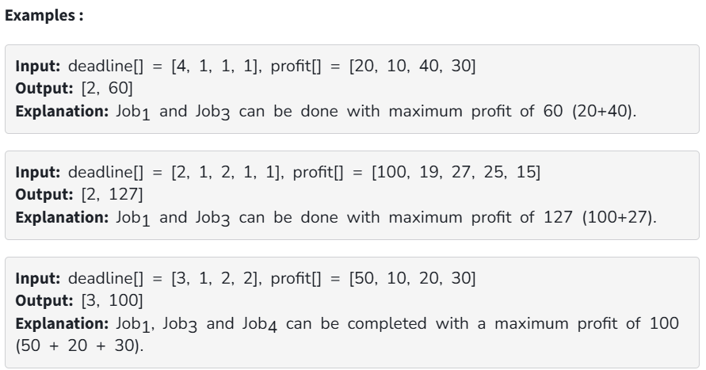

You are given two arrays: deadline[], and profit[], which represent a set of jobs, where each job is associated with a deadline, and a profit. 
Each job takes 1 unit of time to complete, and only one job can be scheduled at a time. You will earn the profit associated with a job only if it is 
completed by its deadline.

Your task is to find:

The maximum number of jobs that can be completed within their deadlines.

The total maximum profit earned by completing those jobs.

Constraints:

1 ≤ deadline.size() = profit.size() ≤ 10^5

1 ≤ deadline[i] ≤ deadline.size()

1 ≤ profit[i] ≤ 500
