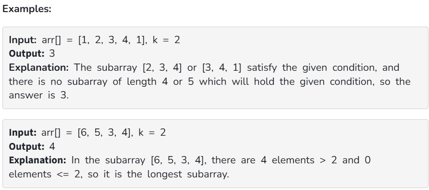

Given an array arr[] and an integer k, the task is to find the length of longest subarray in which the count of elements greater than k is more than the count of elements less than or equal to k.

Constraints:

1 ≤ arr.size() ≤ 10^6

1 ≤ arr[i] ≤ 10^6

0 ≤ k ≤ 10^6
