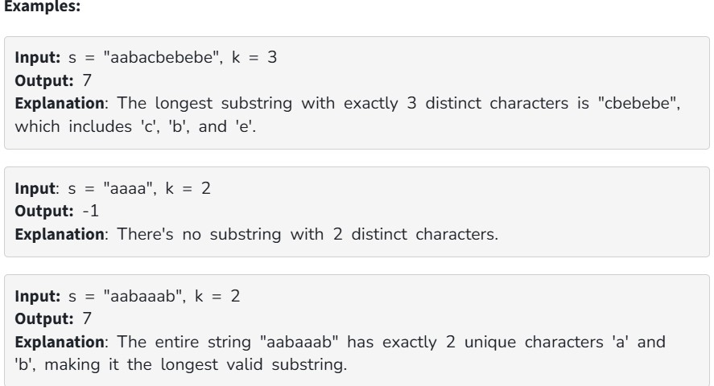

You are given a string s consisting only lowercase alphabets and an integer k. Your task is to find the length of the longest substring that contains exactly k distinct characters.

Note : If no such substring exists, return -1. 

Constraints:

1 ≤ s.size() ≤ 10^5

1 ≤ k ≤ 26
