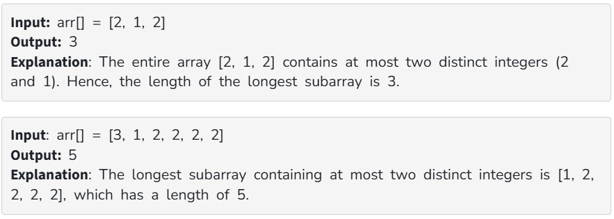

Given an array arr[] consisting of positive integers, your task is to find the length of the longest subarray that contains at most two distinct integers.

Examples:

Constraints:

1 ≤ arr.size() ≤ 10^5

1 ≤ arr[i] ≤ 10^5
