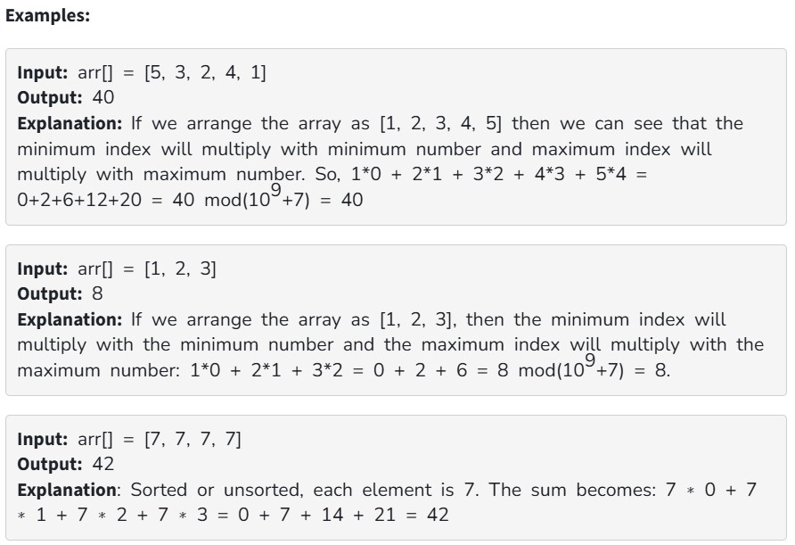

Given an array, arr of integers. Your task is to write a program to find the maximum value of ∑arr[i]*i, where i = 0, 1, 2,., n-1. You are allowed to rearrange the elements of the array.
Note: Since the output could be large, print the answer modulo 10^9+7.

Constraints:

1 ≤ arr.size ≤ 10^5

1 ≤ arr[i] ≤ 10^5
