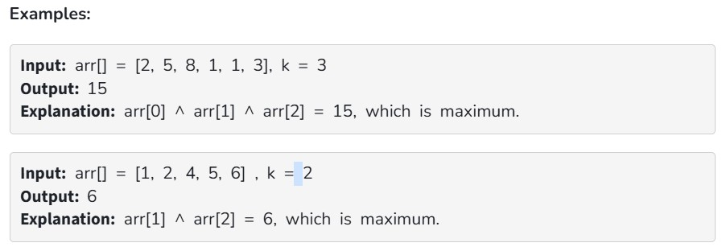

Given an array of integers arr[]  and a number k. Return the maximum xor of a subarray of size k.

Note: A subarray is a contiguous part of any given array.

Constraints:
1 ≤ arr.size() ≤ 10^6

0 ≤ arr[i] ≤ 10^6

1 ≤ k ≤ arr.size()
