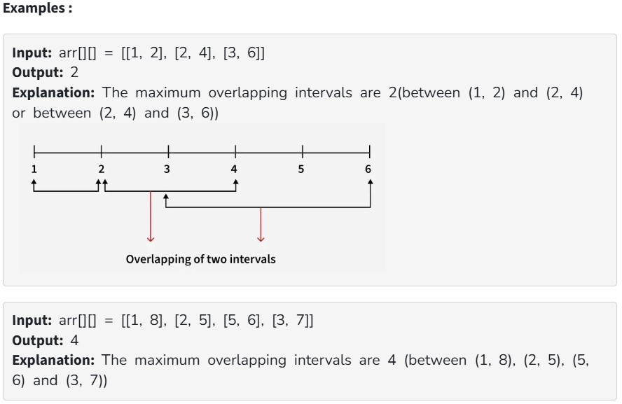

You are given an array of intervals arr[][], where each interval is represented by two integers [start, end] (inclusive). Return the maximum number of intervals that overlap at any point in time.

Constraints:

2 ≤ arr.size() ≤ 2 * 10^4

1 ≤ arr[i][0] < arr[i][1] ≤ 4*10^6
