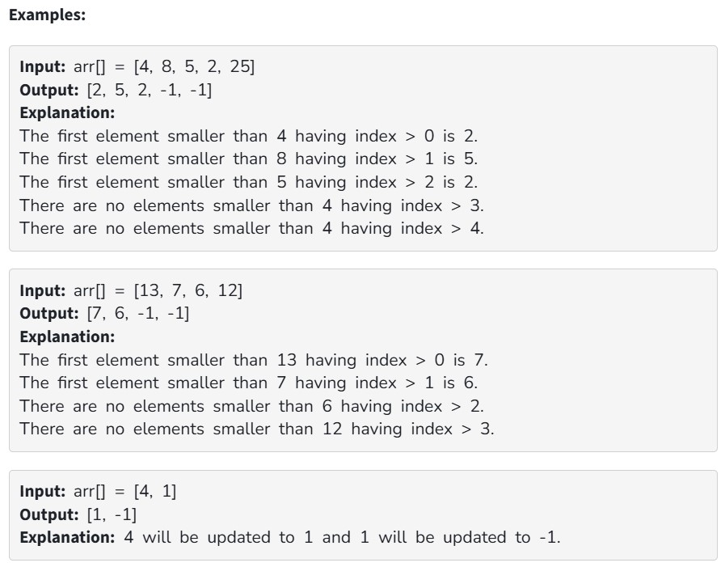

You are given an integer array arr[ ]. For every element in the array, your task is to determine its Next Smaller Element (NSE).

The Next Smaller Element (NSE) of an element x is the first element that appears to the right of x in the array and is strictly smaller than x.

If no such element exists, assign -1 as the NSE for that position.

Constraints:

1 ≤ arr.size() ≤ 10^5

1 ≤ arr[i] ≤ 10^5
