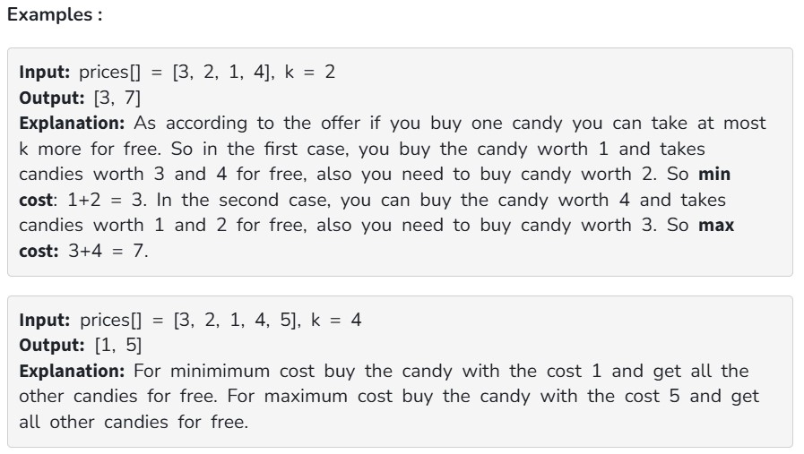

In a candy store, there are different types of candies available and prices[i] represent the price of  ith types of candies. You are now provided with an attractive offer.

For every candy you buy from the store, you can get up to k other different candies for free. Find the minimum and maximum amount of money needed to buy all the candies.

Note: In both cases, you must take the maximum number of free candies possible during each purchase.

Constraints:

1 ≤ prices.size() ≤ 10^5

0 ≤ k ≤ prices.size()

1 ≤ prices[i] ≤ 10^4
