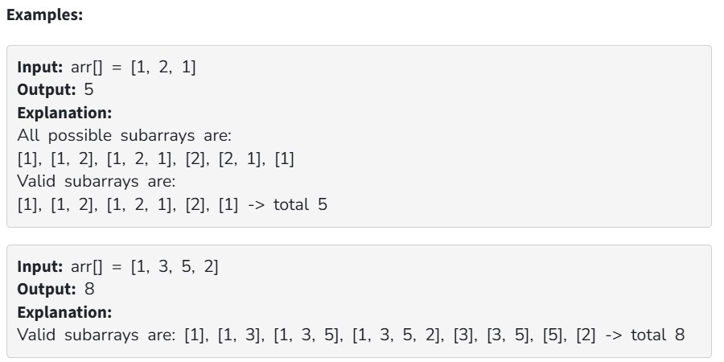

You are given an integer array arr[ ]. Your task is to count the number of subarrays where the first element is the minimum element of that subarray.

Note: A subarray is valid if its first element is not greater than any other element in that subarray.

Constraints:

1 ≤ arr.size() ≤ 5*10^4

1 ≤ arr[i] ≤ 10^5
