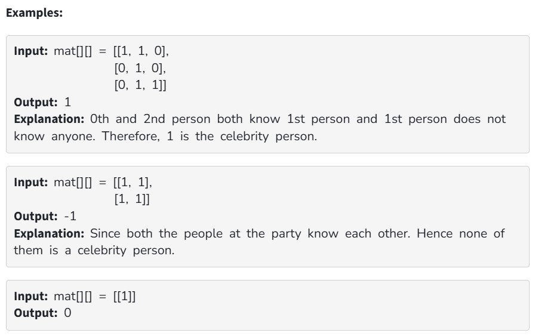

A celebrity is a person who is known to all but does not know anyone at a party. A party is being organized by some people. A square matrix mat[][] of size n*n is used to represent people at the party such that if an element of row i and column j is set to 1 it means ith person knows jth person. You need to return the index of the celebrity in the party, if the celebrity does not exist, return -1.

Note: Follow 0-based indexing.

Constraints:

1 ≤ mat.size() ≤ 1000

0 ≤ mat[i][j] ≤ 1

mat[i][i] = 1
