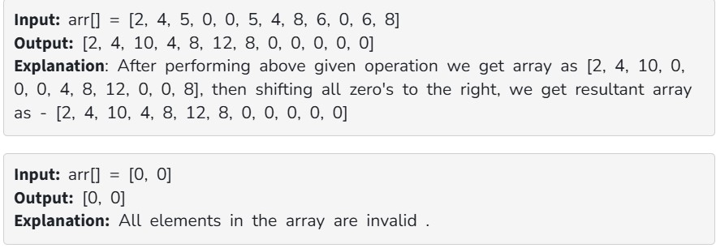

Given an array arr[] containing integers, zero is considered an invalid number, and the rest of the other numbers are valid. If the two nearest valid numbers are equal, then double the value of the first one and make the second number 0. At last, move all the valid numbers on the left.

Examples:

Constraints:

1 ≤ arr.size()≤ 10^6

1 ≤ arr[i]≤ 10^6

Expected Complexities:

Time Complexity: O(n)

Auxiliary Space: O(n)
