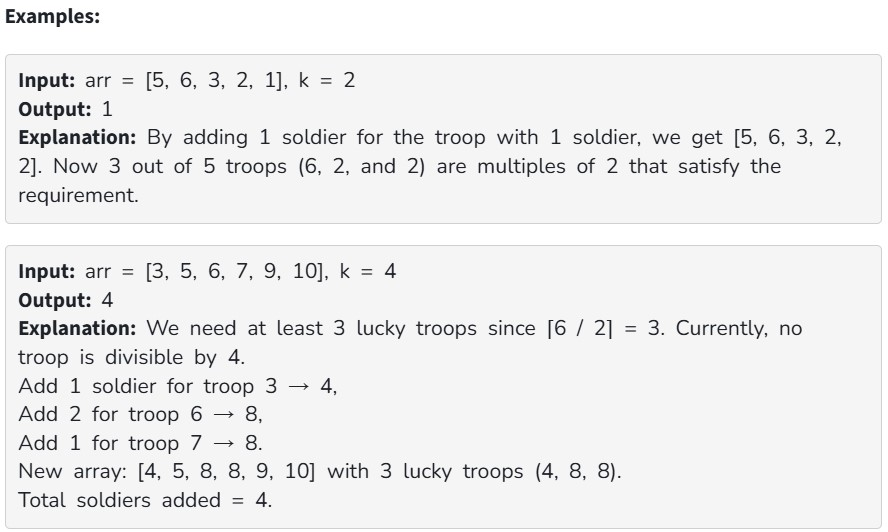

You are given an array arr[] of size n, where arr[i] represents the number of soldiers in the i-th troop. You are also given an integer k. A troop is considered "lucky" if its number of soldiers is a multiple of k. Find the minimum total number of soldiers to add across all troops so that at least ⌈n / 2⌉ troops become lucky.

Constraints:

1 ≤ arr.size() ≤ 10^5

1 ≤ k ≤ 10^9

1 ≤ arr[i] ≤ 10^9
