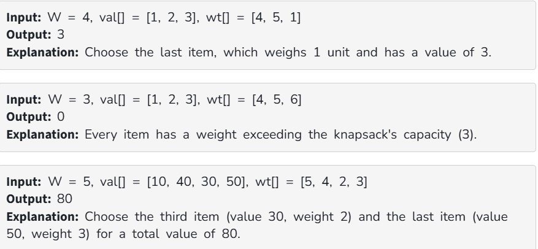

Given two arrays, val[] and wt[], where each element represents the value and weight of an item respectively, and an integer W representing the maximum capacity of the knapsack (the total weight it can hold).

The task is to put the items into the knapsack such that the total value obtained is maximum without exceeding the capacity W.

Note: You can either include an item completely or exclude it entirely — fractional selection of items is not allowed. Each item is available only once.

Constraints:

1 ≤ val.size() = wt.size() ≤ 10^3

1 ≤ W ≤ 10^3

1 ≤ val[i] ≤ 10^3

1 ≤ wt[i] ≤ 10^3
