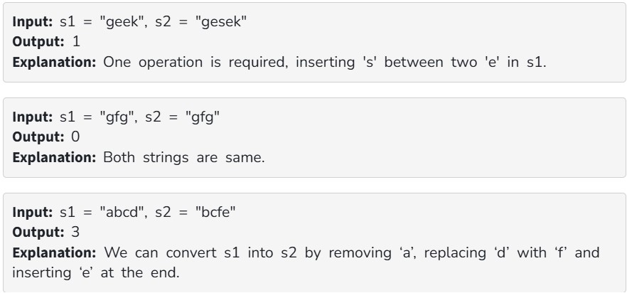

Given two strings s1 and s2. Return the minimum number of operations required to convert s1 to s2.

The possible operations are permitted:

Insert a character at any position of the string.

Remove any character from the string.

Replace any character from the string with any other character.

Examples:

Constraints:

1 ≤ s1.length(), s2.length() ≤ 10^3

Both the strings are in lowercase.
