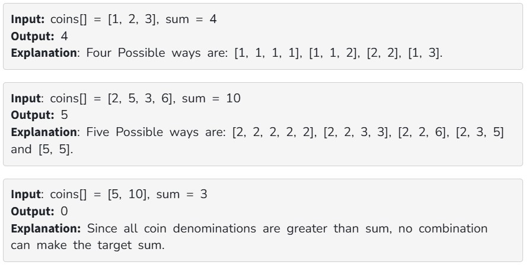

Given an integer array coins[ ] representing different denominations of currency and an integer sum, find the number of ways you can make sum by using different combinations from coins[ ]. 

Note: Assume that you have an infinite supply of each type of coin. Therefore, you can use any coin as many times as you want.

Answers are guaranteed to fit into a 32-bit integer. 

Examples:

Constraints:

1 <= sum <= 10^3

1 <= coins[i] <= 10^4

1 <= coins.size() <= 10^3
