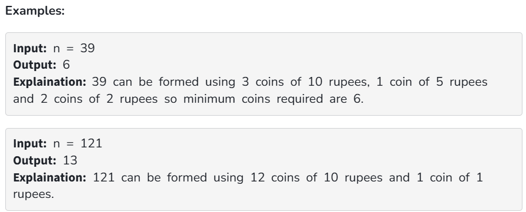

Given an infinite supply of each denomination of Indian currency { 1, 2, 5, 10 } and a target value n. Find the minimum number of coins and/or notes needed to make the change for Rs n. 

Constraints:

1 ≤ n ≤ 10^6
