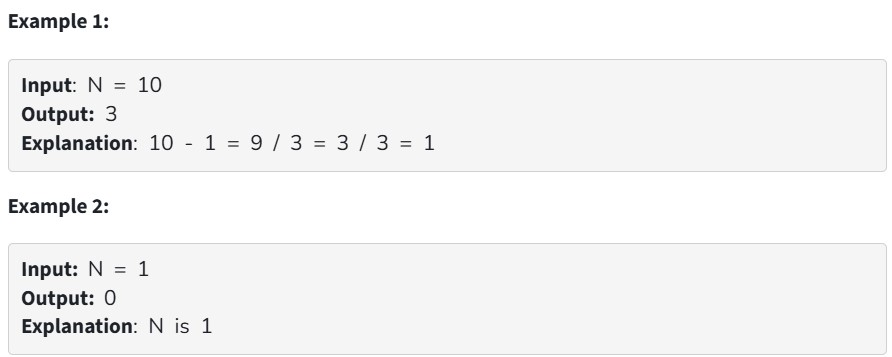

Given a number N, the task is to count minimum steps to minimize it to 1 according to the following criteria:

If N is divisible by 2 then you may reduce N to N/2.

If N is divisible by 3 then you may reduce N to N/3.

Otherwise, Decrement N by 1.

Your Task:  

You don't need to read input or print anything. Complete the function minSteps() which takes N as input parameters and returns the integer value

Expected Time Complexity: O(N)

Expected Auxiliary Space: O(N)

Constraints:

1 ≤ N ≤ 10^4

